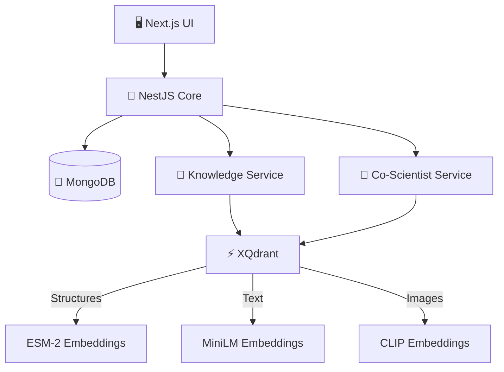
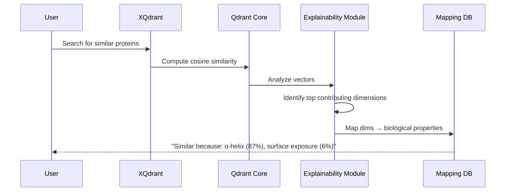

<div align="center">

# 🧬 QDesign

### *AI-Driven Collaborative Biological Design Workbench*

[](LICENSE)
[](https://nextjs.org/)
[](https://nestjs.com/)
[](https://python.org/)
[](https://www.typescriptlang.org/)

[🎥 Watch Demo](https://youtu.be/1vimfGWMWEE) • [🎨 Presentation](https://www.canva.com/design/DAG_6XAIBvE/s5XiOzb92TIEW1BbpaGG5g/edit) • [🚀 Live Demo](https://qdesign.moetezfradi.me)

</div>

---

## ✨ Overview

**QDesign** is a next-generation collaborative platform that revolutionizes biological research by combining **multimodal data integration**, **explainable AI**, and **knowledge graph visualization**. Scientists can create research projects, upload diverse biological data, explore semantic relationships, and leverage AI assistance—all with full biological interpretability.

### 🎯 Key Features

- 📁 **Project Workspaces** - Create collaborative research environments with objectives, constraints, and notes
- 📤 **Multimodal Upload** - Support for PDFs, CIF, FASTA, images, and text documents
- 🔬 **3D Visualization** - Interactive protein structure viewer and data annotation tools
- 🕸️ **Knowledge Graphs** - Auto-generated semantic networks powered by **XQdrant** vector database
- 🔍 **Explainable Search** - Understand *why* proteins are similar in biological terms
- 🤖 **AI Co-Scientist** - Interactive AI assistant with human-in-the-loop feedback
- 📝 **Research Export** - Generate IEEE-formatted research papers automatically
- 🔄 **Git-like History** - Version control for research objectives and findings
- 👥 **Real-time Collaboration** - Live updates and team synchronization

### 🏆 Hackathon Submission

**Category:** Use Case 4 - Multimodal Biological Design & Discovery

---

## 🎯 The Problem We Solve

Modern biological research faces critical challenges:

Modern biological research faces critical challenges:

| Challenge | Impact | Our Solution |
|-----------|---------|--------------|
| 🗂️ **Data Fragmentation** | Scattered across multiple formats | Unified multimodal workspace |
| 🔗 **Hidden Connections** | Valuable relationships remain undiscovered | Automated knowledge graphs |
| ❓ **Explainability Gap** | Vector search doesn't explain *why* | XQdrant explainability layer |
| 🤝 **Collaboration Friction** | Difficult to share context | Real-time collaborative workspaces |
| 📚 **Knowledge Transfer** | Hard to document workflows | Auto-generated IEEE papers |

---

## 🎬 Demo & Resources

<table>
<tr>
<td align="center" width="33%">

### 🎥 Video Demo
[Watch on YouTube](https://youtu.be/1vimfGWMWEE)
*See QDesign in action*

</td>
<td align="center" width="33%">

### 🎨 Presentation
[View on Canva](https://www.canva.com/design/DAG_6XAIBvE/s5XiOzb92TIEW1BbpaGG5g/edit)
*Detailed slide deck*

</td>
<td align="center" width="33%">

### 🚀 Live Demo
[qdesign.moetezfradi.me](https://qdesign.moetezfradi.me)
*Try it yourself*

</td>
</tr>
</table>

#### 🔐 Demo Credentials

**Login:** `123@gmail.com` | **Password:** `123456`

Or create your own account and join with code: **`WKYQ35`**

> ⚠️ *Note: LLM and retrieval endpoints limited due to free tier*

---
## 👥 Team

<div align="center">

**Moetez Fradi** • **Ghassen Naouar** • **Ahmed Saad** • **Omar**

</div>

---
##  Screenshots

### 🖥️ Dashboard Interface

*Modern, intuitive workbench interface*

### 📊 Data Pool Management

*Centralized data collection and organization*

### 📈 Data Visualization

*Interactive tools for exploring biological structures*

### 🕸️ Knowledge Graph

*Multimodal knowledge graph with explanatory edges - PDFs, images, structures, and sequences interconnected*

### 🤖 AI Co-Scientist

<table>
<tr>
<td width="33%">


*Initial workspace view*

</td>
<td width="33%">


*Evidence-based suggestions*

</td>
<td width="33%">


*Human-in-the-loop interaction*

</td>
</tr>
</table>

---

## 🏗️ Architecture

### 📐 System Overview

QDesign follows a microservices architecture with four main components:



**[📋 View Detailed Architecture Diagram](https://drive.google.com/file/d/1Q-FJCkogA3mnIx0_51hClG9zEKPq8VBq/view?usp=sharing)**

### 🧩 Core Components

| Component | Technology | Purpose |
|-----------|-----------|---------|
| **UI** | Next.js 16 + React 19 | Real-time collaborative interface |
| **Core** | NestJS 11 + MongoDB | Authentication, project management, file storage |
| **XQdrant** | Rust (Custom Qdrant fork) | Explainable vector search (see below) |
| **Knowledge Service** | FastAPI + Python | Graph generation & expansion |
| **Co-Scientist** | LangChain + LangGraph | AI research assistant |

---

## ⚡ XQdrant: Explainable Vector Search

### 🤔 The Problem with Standard Vector Databases

Traditional vector databases like Qdrant find similar items but provide **black box results**:

```
"Protein A is 95% similar to Protein B"
```

But **why?** For biological research, understanding the *biological reasons* is critical.

### 💡 Our Solution: XQdrant

**XQdrant** is our custom Rust fork of Qdrant with an **explainability layer** that answers the "why" question.

#### 🔬 How It Works



1. **Standard Search** - User queries for similar structures
2. **Qdrant Core** - Computes similarity across 1280-dim ESM2 embeddings  
3. **Explainability Module** (`explainability.rs`) - Identifies top dimensions contributing to similarity
4. **Biological Mapping** - Maps dimensions to properties using `esm2_dim_to_biological_property.json`
5. **Interpreted Result** - Returns biological explanations

#### 🧪 Example Response

**Query:** Find proteins similar to `1ABC.pdb`

**Traditional Result:**
```json
{
  "id": 42,
  "score": 0.95
}
```

**XQdrant Result:**
```json
{
  "id": 42,
  "score": 0.95,
  "score_explanation": {
    "top_dimensions": [
      {"dimension": 1160, "contribution": 0.878, "property": "α-helix propensity"},
      {"dimension": 234, "contribution": 0.059, "property": "Surface accessibility"},
      {"dimension": 736, "contribution": 0.019, "property": "Charge distribution"}
    ]
  }
}
```

**Interpretation:** *"These proteins are similar because both have high α-helix content (87.8% contribution) and similar surface exposure patterns (5.9%)."*

### 📚 Vector Collections

| Collection | Model | Dimensions | Purpose |
|------------|-------|------------|---------|
| 🧬 `qdesign_structures` | ESM-2 | 1280 | PDB/CIF 3D protein similarity |
| 🔤 `qdesign_sequences` | ESM-2 | 1280 | FASTA homology search |
| 📄 `qdesign_text` | MiniLM-L6-v2 | 384 | PDFs, papers, documents |
| 🖼️ `qdesign_images` | CLIP ViT-B-32 | 512 | Diagrams, microscopy |

### 🔬 Research Foundation

Our dimension-to-property mapping is based on **probing experiments** inspired by [this BioRxiv paper](https://www.biorxiv.org/content/10.1101/2024.11.14.623630v1.full.pdf):

- Extract protein sequences from CIF files
- Generate ESM2 embeddings (1280 dimensions)
- Compute biological properties (secondary structure, accessibility, flexibility)
- Train linear probes to predict properties from embeddings
- Analyze probe weights to identify important dimensions
- Create dimension → biological meaning mappings

📓 **Full methodology:** [Interpretability/esm_cif_interpretability.ipynb](Interpretability/esm_cif_interpretability.ipynb)

---

## 🛠️ Technology Stack

### 🎨 Frontend

| Technology | Version | Purpose |
|------------|---------|---------|
| Next.js | 16.1.4 | React framework with SSR |
| React | 19.2.3 | UI library |
| TypeScript | Latest | Type safety |
| Tailwind CSS | 4.x | Styling |
| Socket.io | 4.8.3 | Real-time sync |
| @xyflow/react | 12.10.0 | Knowledge graph viz |
| NGL | 2.4.0 | 3D molecular viewer |
| React PDF | 10.3.0 | PDF rendering |
| Zustand | 5.0.10 | State management |
| TanStack Query | 5.90.20 | Server state |
| Framer Motion | 12.29.0 | Animations |

### ⚙️ Backend - Core (NestJS)
| Technology | Version | Purpose |
|------------|---------|---------|
| NestJS | 11.0.1 | Backend framework |
### ⚙️ Backend - Core (NestJS)

| Technology | Version | Purpose |
|------------|---------|---------|
| NestJS | 11.0.1 | Backend framework |
| Node.js | 18+ | Runtime |
| MongoDB | 9.1.5 (Mongoose) | Database for users, projects |
| Socket.io | 4.8.3 | WebSocket server |
| JWT | 11.0.2 | Authentication |
| Passport | 0.7.0 | Auth middleware |
| Axios | 1.13.4 | HTTP client |

### 🐍 Backend - Microservices (Python)

| Technology | Version | Purpose |
|------------|---------|---------|
| FastAPI | 0.109.0+ | REST API framework |
| Python | 3.10+ | Runtime |
| Streamlit | 1.53.1 | Interactive UI |
| Uvicorn | 0.27.0+ | ASGI server |
| Pydantic | 2.0.0+ | Data validation |
| LangChain | Latest | LLM orchestration |
| LangGraph | Latest | Agent workflows |

### 🔮 Vector Database & Embeddings

| Technology | Version | Purpose |
|------------|---------|---------|
| **XQdrant** | Custom Fork | Explainable vector search |
| Qdrant Client | 2.7.0+ | Vector DB client |
| Sentence Transformers | 3.3.1 | Text embeddings (384-dim) |
| ESM-2 | 2.0.0+ (fair-esm) | Protein embeddings (1280-dim) |
| CLIP | 1.0.0+ (openai-clip) | Image embeddings (512-dim) |
| PyTorch | 2.0.0+ | Deep learning backend |

### 📊 Data Pipeline

| Technology | Version | Purpose |
|------------|---------|---------|
| Biopython | Latest | Biological data parsing |
| NumPy | 2.4.1 | Numerical computing |
| Pandas | Latest | Data manipulation |
| Requests | 2.32.5 | HTTP requests |
| TQDM | 4.67.1 | Progress bars |

---

## 🚀 Quick Start

### 📋 Prerequisites

- **Node.js** 18+ and **pnpm**
- **Python** 3.10+
- **MongoDB** (local or Atlas)
- **Rust** (for XQdrant)
- **Docker** (optional)

### 📥 Installation

#### 1️⃣ Clone Repository

```bash
git clone https://github.com/your-org/qdesign.git
cd qdesign
```

#### 2️⃣ Backend Core (NestJS)

```bash
cd backend/Core
npm install
cp .env.example .env
# Edit .env with MongoDB URI, JWT secret, service URLs
npm run start:dev  # Starts on http://localhost:3000
```

#### 3️⃣ Frontend (Next.js)

```bash
cd ui
pnpm install
cp .env.example .env.local
# Edit .env.local with API URLs
pnpm dev:all  # Frontend + Socket.io server
```

#### 4️⃣ XQdrant Vector Database

```bash
cd XQdrant
cargo build --release
./target/release/qdrant-server  # Starts on http://localhost:6333
```

Or use Docker:
```bash
docker run -p 6333:6333 -v $(pwd)/qdrant_storage:/qdrant/storage xqdrant/xqdrant:latest
```

#### 5️⃣ Microservices

**Knowledge Service:**
```bash
cd backend/Services/knowledge_service
python -m venv venv && source venv/bin/activate
pip install -r requirements.txt
uvicorn main:app --reload --port 8001
```

**Co-Scientist Service:**
```bash
cd backend/Services/co_scientist_service
python -m venv venv && source venv/bin/activate
pip install -r requirements.txt
# Add OpenAI/Anthropic API keys to .env
uvicorn main:app --reload --port 8003
```

### ✅ Verify Installation

```bash
# Backend Core
curl http://localhost:3000/health

# Frontend
open http://localhost:3000

# XQdrant
curl http://localhost:6333/collections

# Knowledge Service
curl http://localhost:8001/health

# Co-Scientist
curl http://localhost:8003/health
```

---

## 📚 Usage Examples

### 🔬 Example 1: Creating a Research Project

1. Navigate to `http://localhost:3000` and register
2. Click **"New Project"**
3. Fill in details:
   - **Name:** "Protein Stability Analysis"
   - **Objective:** "Identify thermostable protein variants"
   - **Constraints:** "Temp: 60-80°C, pH: 6-8"
4. Upload files:
   - `📄 thermostability_review.pdf`
   - `🧬 1ABC.pdb`
   - `🔤 candidate_proteins.fasta`
   - `📊 stability_curve.png`
5. Click **"Generate Knowledge Graph"**

### 🕸️ Example 2: Generating Knowledge Graphs

```python
import requests

response = requests.post(
    "http://localhost:8001/knowledge-graph/generate",
    json={
        "project_id": "proj_12345",
        "similarity_threshold": 0.75,
        "max_connections": 50
    }
)

graph = response.json()
print(f"📊 Generated {len(graph['nodes'])} nodes, {len(graph['edges'])} edges")

# Explore an edge
edge = graph['edges'][0]
print(f"🔗 {edge['source']} → {edge['target']}")
print(f"💯 Similarity: {edge['weight']:.2%}")
print(f"🧬 Reason: {edge['biological_explanation']}")
```

### 🔍 Example 3: Explainable Search with XQdrant

```python
from qdrant_client import QdrantClient

client = QdrantClient(url="http://localhost:6333")

results = client.search(
    collection_name="qdesign_structures",
    query_vector=[...],  # ESM2 embedding
    limit=10,
    with_explanation=True  # 🔑 Enable explainability
)

for result in results:
    print(f"\n🧬 Protein: {result.id} | Score: {result.score:.3f}")
    
    for dim in result.score_explanation.top_dimensions[:3]:
        prop = dimension_to_property[dim['dimension']]
        contrib = dim['contribution'] * 100
        print(f"  • {prop}: {contrib:.1f}% contribution")
```

**Output:**
```
🧬 Protein: P12345 | Score: 0.952
  • α-helix propensity: 87.8% contribution
  • Surface accessibility: 5.9% contribution
  • Charge distribution: 1.9% contribution
```

### 🤖 Example 4: AI Co-Scientist Query

```python
response = requests.post(
    "http://localhost:8003/coscientist/query",
    json={
        "project_id": "proj_12345",
        "query": "What mutations improve thermostability?",
        "context": {
            "include_graph": True,
            "constraints": ["Temp: 60-80°C", "pH: 6-8"]
        }
    }
)

for chunk in response.json()['chunks']:
    print(f"\n📝 {chunk['type']}")
    print(chunk['content'])
    print(f"📚 Evidence: {', '.join(chunk['citations'])}")
```

### 📄 Example 5: Export to IEEE Paper

```javascript
const response = await fetch('/api/projects/proj_12345/export', {
  method: 'POST',
  body: JSON.stringify({
    format: 'ieee_pdf',
    include: ['abstract', 'methods', 'results', 'knowledge_graph']
  })
});

const blob = await response.blob();
// Downloads formatted IEEE research paper
```

---

## 📖 Documentation

Detailed documentation for each component:

| 📂 Component | 📄 Documentation |
|-------------|------------------|
| 🧠 **Interpretability** | [docs/interpretability_README.md](docs/interpretability_README.md) |
| 📊 **Data Pipeline** | [docs/data_README.md](docs/data_README.md) |
| 🔧 **Backend Core** | [docs/backend_core_README.md](docs/backend_core_README.md) |
| 🔍 **Retrieval Service** | [docs/backend_services_retrieval_service_README.md](docs/backend_services_retrieval_service_README.md) |
| 🤖 **Co-Scientist** | [docs/backend_services_coscientist_server_README.md](docs/backend_services_coscientist_server_README.md) |
| 🎨 **UI** | [docs/ui_README.md](docs/ui_README.md) |
| ⚡ **XQdrant** | [docs/XQdrant_README.md](docs/XQdrant_README.md) |

---

## 🎯 Core Principles

<div align="center">

### 🔬 Vector-Native
*Biological similarity (shape, function, sequence) drives all logic*

### 🔍 Explainable  
*Every retrieval provides evidence trails and reasoning*

### 🤝 Collaborative
*Real-time synchronization for seamless teamwork*

### 🧬 Multimodal
*Unified handling of proteins, papers, sequences, and images*

</div>

---

## 🌟 What Makes QDesign Unique?

| Feature | Traditional Tools | QDesign |
|---------|------------------|---------|
| **Data Integration** | Siloed formats | Unified multimodal workspace |
| **Similarity Search** | "95% similar" | "Similar due to α-helix (87%)" |
| **Collaboration** | Email attachments | Real-time sync & comments |
| **Knowledge Discovery** | Manual curation | Auto-generated graphs |
| **AI Assistance** | Generic chatbots | Domain-specific co-scientist |
| **Research Output** | Manual writing | Auto-generated IEEE papers |

---

## 📜 License

This project is licensed under the MIT License - see the [LICENSE](LICENSE) file for details.

---

## 🙏 Acknowledgments

- **ESM-2** protein language model by Meta AI
- **Qdrant** vector database foundation
- Research methodology inspired by [BioRxiv paper on ESM interpretability](https://www.biorxiv.org/content/10.1101/2024.11.14.623630v1.full.pdf)
- Open-source community for incredible tools

---

## � Questions or Feedback?

Open an [issue](https://github.com/your-org/qdesign/issues) or start a [discussion](https://github.com/your-org/qdesign/discussions) if you have questions or want to contact us.

**⭐ If you find QDesign useful, please give us a star!**

---

<div align="center">

Made with ❤️ by the QDesign Team

*Empowering biological research through AI and explainability*

</div>
